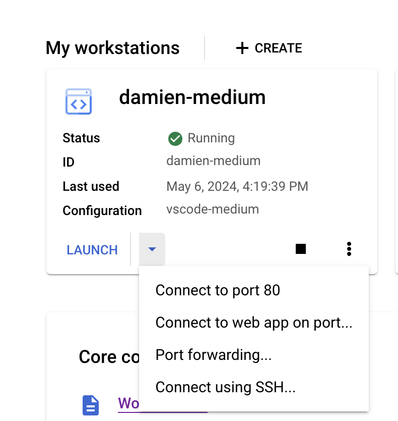

# Cloud Workstations
Cloud Workstations are remote development machines hosted in Google cloud. Workstations provide a full-featured development experience and allow users to connect a remote machine to VSCode. Workstations provide a development experience similar to your laptop with some key differences. 

Workstations... 

* run inside your VPC or cloud network so you can access internal sources  
* are ephemeral and shut down after a maximum runtime
* run a linux OS and allow you to attach accelerators or change the machine type
* provide preconfigured environments freeing users from having to worry about their local setup


## More details:
### Authentication

* Users authenticate to a workstation via IAM using their LDAP. This means that running `gcloud auth login`, etc. is necessary to access google services from the workstation. Like on your laptop, this cached credential is valid for 12 hours and persists between workstation sessions.
* Compared to VertexAI notebooks and CustomJobs, which are typically run as a service account, workstation sessions have more narrowly scoped access. By default, only the creator of a workstation has access to that workstation instance.


### Configuration

* Like your laptop, workstations will go to sleep/shutdown after a period of inactivity. Additionally, there is a maximum runtime before it is shut off. These values are set in the workstation definition (config), and we have started with some defaults.  This activity is measured via SSH or HTTP traffic.
   Furthermore, anything in `/home/` will persist between sessions.


## IDE

* There are two ways to use the IDE:
    * via the web browser, which does not requires an SSH connection, ensuring low latency 
    * by attaching your IDE remote workstation via the remote SSH extension
* Google has some examples of the open source VSCode and Jetbrains.


## Setup
Install the workstation CLI using pip or (recommended) pipx

```shell
pipx install cloud-workstations
```

## Usage

### Determine the type of workstation you want to create
Using the command `workstation list-configs` you can see all configs that are available to you. New workstation configs can be added by an admin. If you have questions about which config to use or have a use case for a new config, please reach out ot #machine-learning-tools.

```shell
workstation list-configs
```
For example you might get a result like this:
```
├── Config: medium
│   ├── 💽 Image: us-central1-docker.pkg.dev/cloud-workstations-images/predefined/code-oss:latest
│   ├── 💻 Machine Type: n2-standard-16
│   ├── ⏳ Idle Timeout (hours): 2.0
│   └── ⏳ Max Runtime (hours): 12.0
```

Which indicates that you have the config `medium` available, and that this will give you a `n2-standard-16` machine with a 2 hour idle timeout and a 12 hour max runtime.


### Create your workstation and start it
```shell
❯ workstation create --config medium --name <WORKSTATION NAME>
❯ workstation start --name <WORKSTATION NAME>
```
If you make a VSCode based IDE image you can also use the `--browser` option will open VSCode directly in your browser. If you'd like to connect your remote machine to your Desktop VSCode app follow the setup directions for local [VS Code][connect-to-a-workstation-with-local-vs-code] and then start your workstation with the `--code` option.

```shell
❯ workstation start --name <WORKSTATION NAME> --code
```

You can also ssh directly to your remote machine. For example, running commands like `ssh <WORKSTATION NAME>` in a local terminal will open an SSH connection to your remote machine.


You can use either the `workstation` CLI or the browser to list, start, and stop workstations. You can view active workstations in the browser at https://console.cloud.google.com/workstations/




### Connect to a Workstation with local VS Code
1. To enable local VS Code to connect to a Workstation, you will need to install the Remote - SSH extension.
2. Setup your `~/.ssh/config` file to include the following:
    ```
    Include ~/.workstations/configs/*.config
    ```
3. Once installed, you can connect to a Workstation by clicking on the green icon in the bottom left corner of VS Code and selecting "Remote-SSH: Connect to Host...". You can then select the workstation host from the list.


1. Install your extensions on the remote host.  VS Code doesn't install some like copilot or Python by default on the remote host. But click on the cloud icon and select which extensions you want to install.


### List your workstations
You can go to https://console.cloud.google.com/workstations/ to see you workstations and status or use the ` workstation list ---user <USER>` command

```shell
❯ workstation list --user damien
Workstations
├── Workstation: damien-medium
    ├── 🛑 Stopped
    ├── User: damien
    ├── 💽 Image: us-central1-docker.pkg.dev/cloud-workstations-images/predefined/code-oss:latest
    ├── 💻 Machine Type: n2-standard-16
    ├── ⏳ Idle Timeout (hours): 2.0
    └── ⏳ Max Runtime (hours): 12.0
Total Workstations:  1
```

Json output is also supported with the `--json` flag.
```shell
❯ workstation list --json | jq '.[] | select(.user == "damien" and .state == "STATE_STOPPED")'
```
Which give you the output:
```json
{
  "name": "damien-medium",
  "user": "damien",
  "project": "example",
  "location": "us-central1",
  "config": "vscode-medium",
  "cluster": "example",
  "state": "STATE_STOPPED",
  "idle_timeout": 2.0,
  "max_runtime": 12.0,
  "type": "n2-standard-16",
  "image": "us-central1-docker.pkg.dev/cloud-workstations-images/predefined/code-oss:latest"
}
```

### Idle vs Max Runtime
Idle Timeout is the amount of time the workstation will wait before shutting down if there is no activity based on the config (in the previous config example that is 4 hours). This is measured via SSH or HTTP traffic.  Max Runtime is the maximum amount of time the workstation will run before shutting down regardless of activity. It is possible to create configs that never idle, or have a max runtime.


### Syncing files to the workstation
There are a few ways to sync files to the workstation.  A built in way is to use the `workstation sync` command.  This command will sync the files in `~/remote-machines/workstation/` to the workstation.  This is useful for syncing your keys and other files that you might like for a customized experience like a custom ~/.zshrc. However there are drag and drop methods, or just doing it directly from the terminal with ssh or rsync.

1.  Option 1: Use `workstation sync --name <WORKSTATION_NAME>` to sync the keys and anything else in  ``~/remote-machines/workstation/` to your home directory on the workstation, with additional options for different directories.
2.  Option 2: Turn on the workstation and drag and drop the files into the file explorer in VS Code.
3.  Option 3: User scp or rsync if you setup your ~/.ssh/config as above and use the commands like normal. For example:

    ```shell
    rsync -avz --exclude=".*" --exclude "*/__pycache__" /path/to/local/folder <WORKSTATION>:/path/to/remote/folder
    ```

#### Example of using workstation sync to sync credentials
You can sync files from your laptop to the workstation using the `workstation sync` command.  This command will sync the files in your local `~/remote-machines/workstation/` directory to the workstation.  This is useful for syncing your keys and other files that you might like for a customized experience like a custom ~/.zshrc. However there are drag and drop methods, or just doing it directly from the terminal. 

For example, if you have followed the directions on [Accessing GitHub](#accessing-github) and saved the Github certificate in `~/remote-machines/workstation/` the following command will sync that cert to the remote machine and enable github access.  Syncing credentails or configuration files only needs to happen once after creating the workstation instance since these will persist on the disk. 

```shell
❯ workstation sync --name damien-medium
building file list ... done
./
.p10k.zsh
.zsh_plugins.txt
.zshrc
.ssh/
.ssh/id_ed25519
.ssh/id_ed25519.pub
test/

sent 95505 bytes  received 182 bytes  63791.33 bytes/sec
total size is 94956  speedup is 0.99
```


## Report issues
Use the issue link above to take you to the repo issue [page](https://github.com/square/workstations/issues). Please include the version of the CLI you are using `❯ workstation --version` and which config.


## Development and Testing

We use [Hermit](https://cashapp.github.io/hermit/) to manage the development environment.  To get started, install Hermit and run the following command

```shell
curl -fsSL https://github.com/cashapp/hermit/releases/download/stable/install.sh | /bin/bash
```

After cloning the repo do `. bin/activate-hermit` which will make the environment available with UV, Ruff, and Just. 

### Render Docs
`just docs`

### Run Tests
`just tests`

### Run local copy
`uv run workstation --version`
### Using VSCode Debugger

If you want to use VS Code debug mode use this profile.
```json
        {
            "name": "Python: Module",
            "type": "debugpy",
            "request": "launch",
            "module": "workstation.cli",
            "console": "integratedTerminal",
            "args": ["list-configs", "--cluster", "<YOUR-CLUSTER>"]
        }
```